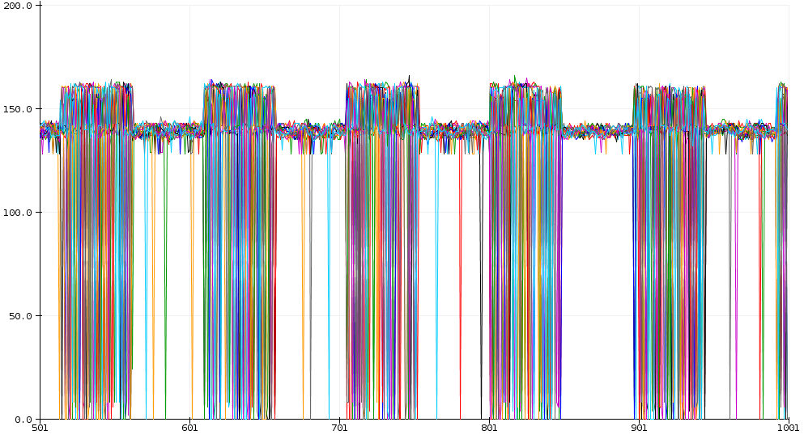

# CurrentSense-TinyML
Current Sensing using embedded TinyML models

See `TinyML-CurrentSense-Writeup.ipynb` for the writeup of this project. The `Arduino_CurrentSense_ML` folder contains the Arduino IDE .ino file that will load the model onto an Arduino Nano 33 Sense board. The rest of the code - for generating training data, recording it, and processing it, can all be found in the jupyter notebook and the `DataCollection` folder.

Work done by Mark C. ([@LargeCardinal](https://twitter.com/LargeCardinal)).

