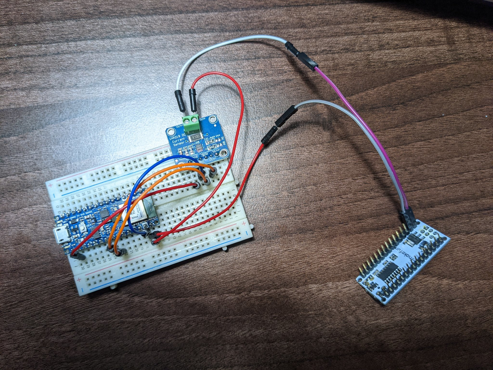
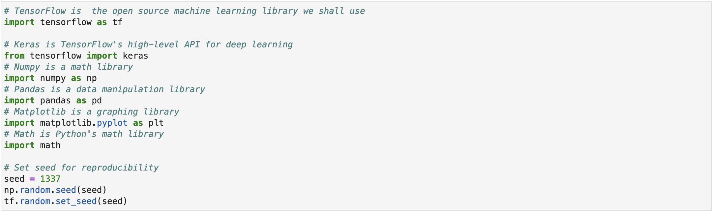

# Welcome to CurrentSense-TinyML

CurrentSense-TinyML is all about detecting microcontroller behaviour with current sensing and TinyML. Basically we are trying to work out what is happening on a target PCB.

This work is inspired by prior work I have done, as well as the work of  at Level Down security. This work is intended to be a working Proof of Concept (PoC) for what is the next logical step in these kinds of attacks - using Machine Learning (ML) in current monitoring side-channel analysis attacks.

GOAL - To detect an LED flashing on a target using an TensorFlow Lite ML model running on a different microcontroller speaking to an INA219 power monitor that is reading the power going into the target.

See [TinyML-CurrentSense-Writeup.ipynb](TinyML-CurrentSense-Writeup.ipynb) for the writeup of this project. The `Arduino_CurrentSense_ML` folder contains the Arduino IDE .ino file that will load the model onto an Arduino Nano 33 Sense board. The rest of the code - for generating training data, recording it, and processing it, can all be found in the jupyter notebook and the `DataCollection` folder.

This is a taster of the resulting behaviour - reading the state of the target LED (in RED) and copying it using the analyser's LED (Yellow):

## What is CurrentSense-TinyML (and does it work?)

Despite prior evidence that says 'yes!' from the work we cited above, there are a few good indicators that this should work. If we setup the INA219 with the Nano 33 Sense and just monitor the Nano target running blink, we can see the following output when we use Arduino IDE's Serial Plotter (using the get_current_data.ino code for those who want to play along at home)

## How Do I Install It?

First things first, we need to get the environment ready. TensorFlow does not support Python v3.9.x, so if you need to, you should run conda activate to enable a python 3.8.x environment. 

We recommend you use a Jupyter Notebook instance as this makes life much easier. 

We first install TensorFlow and then do our imports...

Next up, you will need some hardware:

* INA219 Current Measuring over I2C board
* Arduino Nano ATMEGA329P target board
* Arduino Nano 33 Sense ML capable board
* USB Cables and Laborkabel
* A Breadboard is handy

Support for your target board and the Arduino Nano 33 Sense board in Arduino IDE
The Adafruit_INA219 library installed in Arduino IDE (using Manage Libraries...)

## How Do I Use It?

Ok, so we've convinced ourselves that this should work... or might work... or could work... so let's get started!

We recommend you load the TinyML-CurrentSense-Writeup.ipynb into your Jupyter instance as this is the most detailed explaination as to how you make magic happen. 

## Who Is Behind It?

CurrentSense-TinyML is a research project by Work done by Mark Carney of the Santander Group Cyber Security Research Team. ([@LargeCardinal](https://twitter.com/LargeCardinal)).

